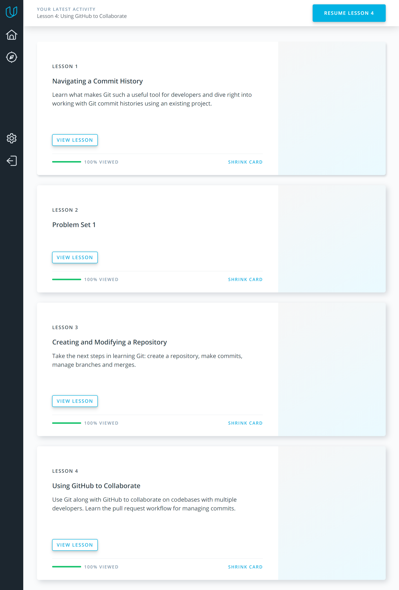
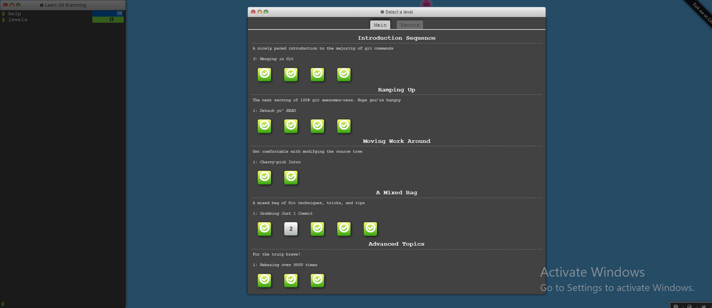

My impressions
===============

Thanks a lot for your program and your help during doing tasks.
I completed all tasks with great interest despite the fact that my English is not good - I use translator and subtitles

Git and GitHub
----------------
I finished the course [How to use Git and GitHub](https://www.udacity.com/course/how-to-use-git-and-github--ud775)

I got familiar with Git and GitHub.

### The main points for me:

* Use console and **Git** for your local project and use **GitHub** if
you want to collaborate with another developers

* **One commit per logical change**

* **"Detached head"** means you are no longer on a branch,
you have checked out a single commit.
If you have warning: "detached HEAD" you should:
git branch temporary
branch git checkout master
git merge temporary branch

* **Branch early and branch often** ^-^

* The best way to create branch is using command - **git checkout -b name_branch**
That will allow not only create it but also switch to it

* To **resolve a merge conflict** caused by competing line changes,
you must **manually** choose which changes to include from
the different branches in a new commit.

* Use **"git push"** if you want to sent your changes to the remote - GitHub

* Use **"git pull"** if you want to get changes from the remote to your local repo

I learned more useful commands from the course [Learn Git branching](https://learngitbranching.js.org/):

* **relative refs**: **~ ^** - 
it allows to move to earlier levels in the commit tree

* **cherry-pick** and **rebase** - that allows to copy a series of commits
below your current location

### Results of Git and GitHub 

