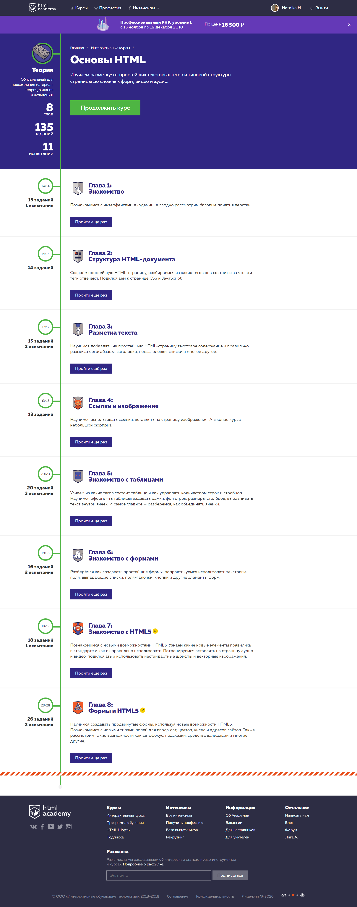
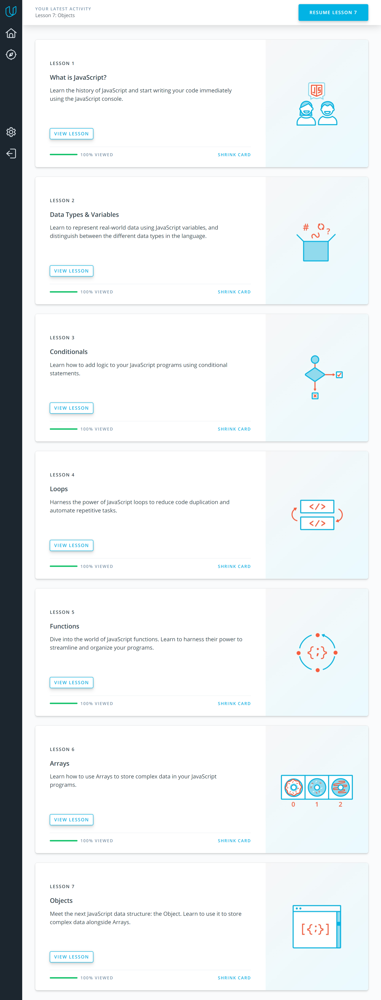

My impressions of the Front-End Course
===============

Thanks a lot for your program and your help during doing tasks.
I completed all tasks with great interest despite the fact that my English is not good - I use translator and subtitles

1 .  Git and GitHub
----------------
I finished the course [How to use Git and GitHub](https://www.udacity.com/course/how-to-use-git-and-github--ud775)

I got familiar with Git and GitHub.

#### The main points for me:

* Use console and **Git** for your local project and use **GitHub** if
you want to collaborate with another developers

* **One commit per logical change**

* **"Detached head"** means you are no longer on a branch,
you have checked out a single commit.
If you have warning: "detached HEAD" you should:
git branch temporary
branch git checkout master
git merge temporary branch

* **Branch early and branch often** ^-^

* The best way to create branch is using command - **git checkout -b name_branch**
That will allow not only create it but also switch to it

* To **resolve a merge conflict** caused by competing line changes,
you must **manually** choose which changes to include from
the different branches in a new commit.

* Use **"git push"** if you want to sent your changes to the remote - GitHub

* Use **"git pull"** if you want to get changes from the remote to your local repo

I learned more useful commands from the course [Learn Git branching](https://learngitbranching.js.org/):

* **relative refs**: **~ ^** - 
it allows to move to earlier levels in the commit tree

* **cherry-pick** and **rebase** - that allows to copy a series of commits
below your current location

#### Results of Git and GitHub 

4 .  Intro to HTML and CSS
-------------------

It is great start for beginners. These materials are very useful and understandable. 
I have finished these two courses: 

1. [Udacity - Intro to HTML & CSS (Eng)](https://www.udacity.com/course/intro-to-html-and-css--ud001)

2. [HTML Academy - Basics of HTML](https://htmlacademy.ru/courses/basic-html)

3. [HTML Academy - Basics of CSS](https://htmlacademy.ru/courses/basic-css)
 
#### It was interesting for me:
* DevTools 
* Validator
* Forms 
* Selector combinators like ~ and + and >
* [Pseudo Class Selectors](https://css-tricks.com/pseudo-class-selectors/)
* HTML5

#### Difficulties with understanding:
[Pseudo Elements](https://css-tricks.com/pseudo-element-roundup/)

#### Extra materials
##### There was something else that surprised me:

* [Free online-courses of HtmlAcademy - 2017](https://coursehunters.net/course/bazovyy-html-i-css-18-2017)
* [Доклад о доступности от В. Макеева](https://www.youtube.com/watch?v=MWJKwn_gKR4)
* [Сокращённые свойства CSS — HTML Шорты](https://www.youtube.com/watch?v=3gvjDqhYJ60&index=20&list=PLQJNT2fdCJngOj0mGZaTcZRyfSBTCWHe1)
* [Как правильно вставлять SVG — HTML Шорты](https://www.youtube.com/watch?v=TNX0-JLdM_U&index=18&list=PLQJNT2fdCJngOj0mGZaTcZRyfSBTCWHe1)
* [Слова, часто используемые в CSS-классах](https://github.com/yoksel/common-words)

#### Results of Intro to HTML and CSS

5 .  Responsive Web Design
-------------------
I have finished the course Responsive Web Design Fundamentals. 
It was really helpful and interesting for me. Thanks a lot

#### I intend to use in future:
* flexbox
* viewport
* relative width
* target touch size
* media queries
* breakpoints
* responsive patterns and tables

#### New to me:
* responsive tables and images
* remote debugging Intro
* Grids

#### Extra materials 

* [Чётко и резко - В. Макеев](https://www.youtube.com/watch?v=n0Vy9cYES-4) +
[presentation](https://pepelsbey.net/pres/clear-and-sharp/#21)

* [A Pixel Identity Crisis](https://alistapart.com/article/a-pixel-identity-crisis) + [Ru](https://habr.com/post/145619/)

* [The 100% correct way to do CSS breakpoints](https://medium.freecodecamp.org/the-100-correct-way-to-do-css-breakpoints-88d6a5ba1862) +
[Ru](http://css-live.ru/articles-css/pravilnye-kontrolnye-tochki-v-css.html)

* [Designing for Breakpoints](https://alistapart.com/article/designing-for-breakpoints) +
[Ru](https://frontender.info/designing-for-breakpoints/)

#### Results of Responsive Web Design

6 .  JavaScript Basics
-------------------
Thanks to the course [Intro to JavaScript](https://www.udacity.com/course/intro-to-javascript--ud803) from Udacity I 
got a basic knowledge of JavaScript. The way of presenting the materials was  very creative and accessible.
What was new to me?
* special characters
* ternary operator
* global and local scope
* objects

The course [Intermediate Algorithm Scripting Challenges](https://learn.freecodecamp.org/javascript-algorithms-and-data-structures/intermediate-algorithm-scripting/) from Freecodecamp wasn't easy for me and I often used the 
hints, but there were some things that surprised me:
* arguments object
* regular expressions
* method replace
* method charCodeAt

